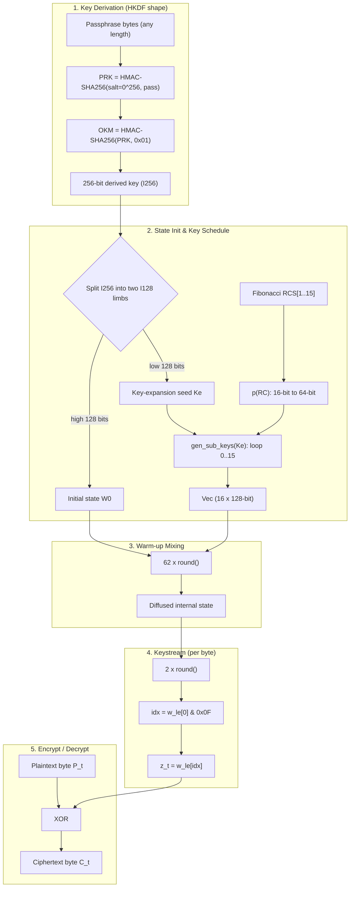
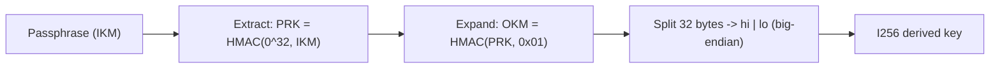
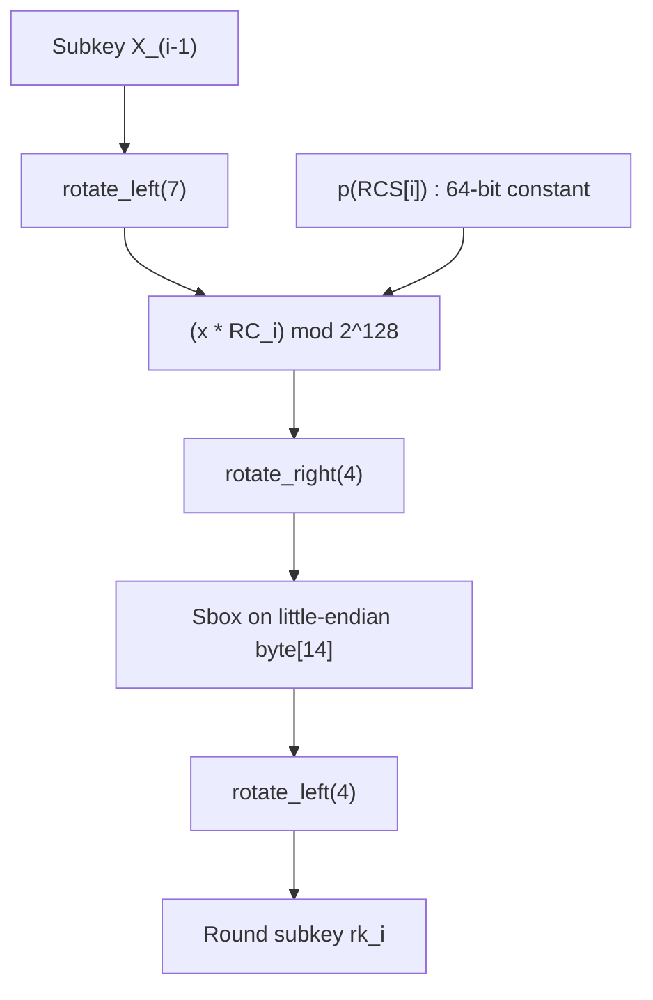
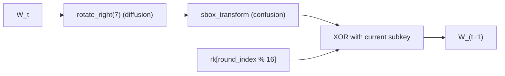
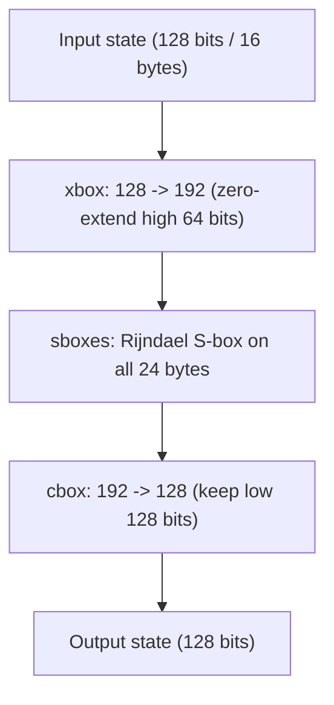
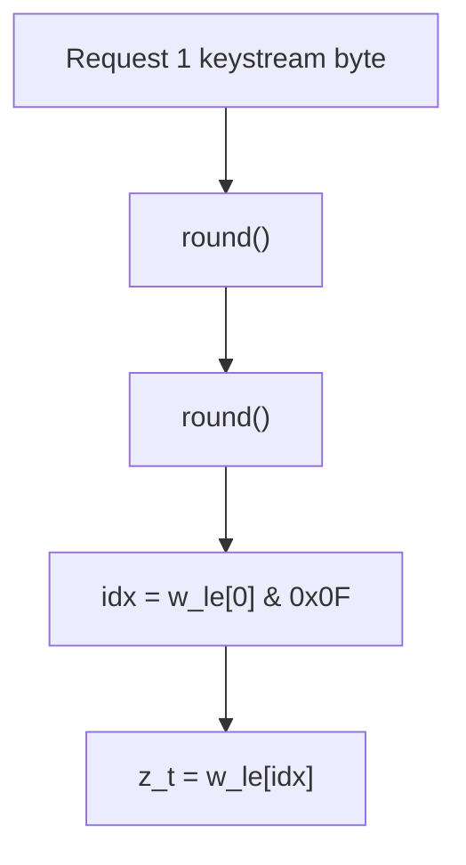

# Pich256 Stream Cipher: Specification, Architecture & Design Document

---

## 1. Executive Summary & Philosophy

**Pich256** is a symmetric-key, byte-oriented **synchronous stream cipher** implemented in **pure Rust **. It derives a cryptographically strong 256-bit key from an arbitrary-length passphrase, expands it into a ring of 16 round subkeys, and drives an evolving 128-bit internal register through a **rotate → substitute → key-mix** round function. Each emitted keystream byte is XORed with plaintext (to encrypt) or ciphertext (to decrypt):

$$C_t = P_t \oplus z_t \iff P_t = C_t \oplus z_t$$

Pich256 borrows the *shape* of a Substitution-Permutation Network (SPN) round — an S-box confusion layer combined with rotational diffusion and round-key addition — and folds it into a stateful keystream generator with a data-dependent output tap. It is written on top of a small hand-rolled big-integer layer (`I128`, `I192`, `I256`) so that the whole cipher, its KDF, and its arithmetic are self-contained with **zero external dependencies**.

### Key Architectural Pillars

1. **HKDF-style Key Derivation (Extract-then-Expand)**
   - Instead of an iterated hash chain, Pich256 uses an **HMAC-SHA-256 extract step** followed by an **expand step** (RFC 5869 shape) to turn any passphrase into a uniform 256-bit key.
2. **Rijndael S-box Confusion Core (`sbox_transform`)**
   - The non-linear layer is the classic **1-D 256-entry Rijndael (AES) S-box** applied byte-wise, wrapped by a widen-to-192 / narrow-to-128 pipeline (`xbox` → `sboxes` → `cbox`).
3. **Fibonacci Subkey Ring (round-robin `Vec`)**
   - 16 distinct 128-bit subkeys are generated from a seed limb via a non-linear generator `g`, driven by **Fibonacci round constants** replicated to 64 bits. They are cycled with a modular round-robin index rather than a linked list.
4. **Warm-up Avalanche Mixing (62 rounds)**
   - Before any keystream is released, the state is advanced **62 full rounds** to decorrelate the output from the raw key material.
5. **Data-Dependent Keystream Tap**
   - Every output byte costs **2 rounds**; the byte is then read from a position chosen by the **low nibble of the state's first (little-endian) byte** — the output tap moves with the data.

---

## 2. Specification & Parameters

| Parameter | Value / Specification | Description |
| :--- | :--- | :--- |
| **Cipher Type** | Symmetric synchronous stream cipher | Byte-oriented keystream XOR |
| **Language / Edition** | Rust 2024, no `unsafe`, no external crates | Self-contained, `#![no_std]`-friendly core logic |
| **Key Size ($K$)** | 256 bits (32 bytes) | Derived from an arbitrary-length passphrase |
| **Internal State ($W$)** | 128 bits (16 bytes) | `I128` working register |
| **Subkey Count ($N_k$)** | 16 subkeys × 128 bits | Round-robin ring over a `Vec<Roundkey>` |
| **Round Constants ($RC$)** | Fibonacci: $\{1,1,2,3,5,8,\dots,987\}$ | 16 values, 16-bit each, expanded to 64 bits |
| **RC Expansion $P$** | 4-fold 16→64-bit replication | `(x<<48)|(x<<32)|(x<<16)|x` |
| **Warm-up Rounds ($R_\text{init}$)** | 62 | Pre-output mixing phase |
| **Rounds per Byte ($R_\text{byte}$)** | 2 | State advance per keystream byte |
| **S-Box** | Rijndael/AES S-box, 256 entries (1-D) | Byte-wise substitution (bijective, no fixed points) |
| **Confusion Pipeline** | `xbox` (128→192) → `sboxes` → `cbox` (192→128) | Widen, substitute, narrow |
| **KDF** | HKDF-shape (HMAC-SHA-256 extract + expand) | `PRK = HMAC(0³², pass)`, `OKM = HMAC(PRK, 0x01)` |
| **Hash Primitive** | SHA-256 + HMAC-SHA-256 (pure Rust) | FIPS 180-4 / RFC 2104 |
| **Big-int Backing** | `I128` (native `i128` newtype), `I192`, `I256` (limb arrays) | Custom arithmetic types |

---

## 3. High-Level Architectural Flow



---

## 4. Mathematical Formulations & Component Details

### 4.1. Key Derivation Function (`derive_256bit_key`)

Pich256 does **not** iterate a bare hash. It uses the two-step **HKDF** construction (RFC 5869) with a fixed all-zero salt and a single expansion block. Given a passphrase (used as HKDF *input keying material*):

$$\text{PRK} = \text{HMAC-SHA256}\big(\underbrace{0^{256}}_{\text{salt}},\; \text{pass}\big)$$

$$\text{OKM} = \text{HMAC-SHA256}\big(\text{PRK},\; \texttt{0x01}\big) \quad (32\ \text{bytes})$$

The 32-byte output is split, big-endian, into the two halves of the 256-bit key:

$$K_\text{base} = \underbrace{\text{OKM}[0..16]}_{\text{hi}} \cdot 2^{128} + \underbrace{\text{OKM}[16..32]}_{\text{lo}}$$



An empty passphrase is valid — HMAC accepts a zero-length message — so `Pich256::new("")` is well-defined.

---

### 4.2. Key Split & Subkey Schedule (`gen_sub_keys`)

The 256-bit key is partitioned into two 128-bit `I128` limbs with distinct roles:

- **High 128 bits → $W_0$**: the initial 16-byte working state.
- **Low 128 bits → $K_e$**: the seed for the subkey schedule.

$$K_\text{base} = W_0 \cdot 2^{128} + K_e$$

```
+-----------------------------------+-----------------------------------+
|     W_0  (Initial State, hi)       |     K_e  (Key-Expansion Seed, lo) |
|              128 bits              |              128 bits             |
+-----------------------------------+-----------------------------------+
|<------------------------- Derived Key: 256 bits --------------------->|
```

**Subkey 0** is the seed itself: $rk_0 = K_e$ (paired with $RC_0 = 1$, unexpanded).
**Subkeys 1..15** are chained through the generator $g$, each with an expanded Fibonacci constant.

#### Round-Constant Expansion $P(x)$

For a 16-bit Fibonacci constant $RC_i \in \{1,1,2,3,5,8,13,21,34,55,89,144,233,377,610,987\}$:

$$P(x) = (x \ll 48)\;|\;(x \ll 32)\;|\;(x \ll 16)\;|\;x \quad \in \{0,1\}^{64}$$

#### Subkey Generator $g(X, RC)$

For $i \in [1,15]$, $\;rk_i = g(rk_{i-1}, P(RC_i))$, where $g:\{0,1\}^{128}\times\{0,1\}^{64}\to\{0,1\}^{128}$:

$$Y_1 = X \lll_{128} 7$$
$$Y_2 = (Y_1 \cdot RC) \bmod 2^{128}$$
$$Y_3 = Y_2 \ggg_{128} 4$$
$$\text{byte}_{14}(Y_3) \leftarrow \text{Sbox}\big[\text{byte}_{14}(Y_3)\big] \quad (\text{little-endian index 14})$$
$$g(X, RC) = Y_3 \lll_{128} 4$$



The 16 subkeys are stored in a `Vec<Roundkey>` and consumed round-robin:

$$rk_0 \to rk_1 \to \dots \to rk_{15} \to rk_0 \to \dots \quad(\text{index} = \text{round index} \bmod 16)$$

The counter uses `wrapping_add`, so an arbitrarily long stream never panics on overflow.

---

### 4.3. The Round Transformation (`round`)

Each round evolves the 128-bit state $W$ with three layers: rotational diffusion, non-linear substitution, and round-key XOR:

$$W_{t+1} = f\big(W_t \ggg_{128} 7\big) \oplus rk_{\,i}, \quad i = \text{round index} \bmod 16$$

where $f$ is the confusion core `sbox_transform` (§4.4). The round index then advances by 1.



---

### 4.4. The Confusion Core: `sbox_transform`

The non-linear function is a three-stage pipeline:

$$f(X) = \text{cbox}\Big(\text{sboxes}\big(\text{xbox}(X)\big)\Big) \qquad (f = \texttt{sbox transform})$$



#### Layer 1 — `xbox` (128 → 192): zero-extension

The 128-bit input becomes the low 128 bits of an `I192`; the upper 64 bits are set to zero:

$$\text{xbox}(X) = (\underbrace{0}_{\text{hi}},\; X_\text{hi},\; X_\text{lo})$$

#### Layer 2 — `sboxes` (192 → 192): byte-wise substitution

All 24 big-endian bytes are passed through the Rijndael S-box $S$:

$$y[k] = S\big[x[k]\big], \quad k = 0,\dots,23$$

$S$ is the standard AES S-box: for each byte, the multiplicative inverse in $\mathrm{GF}(2^8)$ (with $0\mapsto 0$) followed by a fixed affine map. It is **bijective** and has **no fixed points** ($S(x)\neq x$ and $S(x)\neq \overline{x}$ for all $x$) — properties enforced by unit tests.

```
Rijndael S-box: a fixed 16 x 16 lookup table (256 entries)
        x0  x1  x2 ...  xf
   0x  63  7c  77 ...  76
   1x  ca  82  c9 ...  c0
   ..  ..  ..  .. ...  ..
   fx  8c  a1  89 ...  16
```

#### Layer 3 — `cbox` (192 → 128): truncation

The result keeps only the low 128 bits (middle and low limbs); the high limb — which held only the zero-extension from `xbox` plus its substitution — is discarded:

$$\text{cbox}(Y) = (Y_\text{mid} \ll 64)\;|\;Y_\text{lo}$$

> **Net effect.** Because `xbox` zero-extends and `cbox` drops exactly that extension, the two outer layers cancel, and `sbox_transform` is **equivalent to applying the Rijndael S-box independently to each of the 16 bytes** of the 128-bit state. This equivalence is asserted directly in the test suite. The 192-bit detour is structural headroom for a future non-linear compression stage (e.g. AND/OR folding), not extra mixing today.

---

### 4.5. Keystream Byte Emission (`next_byte`)

To produce one keystream byte $z_t$:

1. Advance the state **two rounds**: $W \leftarrow \text{round}(\text{round}(W))$.
2. Take the low nibble of the **little-endian byte 0** as a dynamic index
   (`W[0] & 0x0F`, equivalently mod 16):
   $$\text{idx} = W_\text{le}[0] \bmod 16 \in [0,15]$$
3. Output the state byte at that position:
   $$z_t = W_\text{le}[\text{idx}]$$



Encryption and decryption are the same operation — pull $n$ keystream bytes and XOR — so `encrypt` and `decrypt` are byte-for-byte identical in logic; a fresh instance keyed the same way reproduces the keystream from the start.

---

## 5. Data Structures & Memory Layout

### 5.1 `I128` — the working register

A `#[repr(transparent)]` newtype over the native `i128`, with wrapping arithmetic, rotations, and big/little-endian byte (de)serialization. Using the native type lets the compiler lower 128-bit math onto whatever the target CPU provides.

```rust
#[repr(transparent)]
pub struct I128(pub i128);
// hi()/lo() -> i64 halves; rotate_left/right; to/from_{le,be}_bytes; +,-,*,^,&,|,!
```

### 5.2 `I192` — the confusion-pipeline intermediate

Three 64-bit limbs `[lo, mid, hi]` (LE) with full-width add/sub/neg/mul via carry propagation. Used only inside `sbox_transform`.

```rust
#[repr(transparent)]
pub struct I192(pub [i64; 3]);   // hi()/mid()/lo(); to/from_be_bytes([u8;24])
```

### 5.3 `I256` — the derived key

Two 128-bit limbs `[lo, hi]` (LE); carries the 256-bit KDF output before it is split.

```rust
#[repr(transparent)]
pub struct I256(pub [i128; 2]);  // hi()/lo() -> i128
```

### 5.4 `Roundkey` — one schedule entry

```rust
pub struct Roundkey {
    pub id: u8,        // 0..15
    pub sub_key: I128,
    pub rc: i64,       // expanded round constant (RC_0 stored unexpanded)
}
```

### 5.5 `State` / `Pich256`

```rust
struct State {
    w: I128,                 // 128-bit working register
    sub_keys: Vec<Roundkey>,   // 16 entries, cycled by round_index % 16
    round_index: usize,        // monotonic, wrapping
}

pub struct Pich256 { st: State }   // public: new(&str), encrypt(&[u8]), decrypt(&[u8])
```

---

## 6. Cryptographic Properties & Design Rationale

### 6.1 Confusion & Diffusion
- **Confusion** comes from the Rijndael S-box (byte-wise, in both the round function and the subkey generator `g`) and from the modular multiplication by round constants in the key schedule.
- **Diffusion** comes from the 7-bit right rotation each round and the 128-bit modular multiply in `g`. Note that within a single round the S-box acts byte-locally; cross-byte diffusion is carried entirely by the rotation across successive rounds. This is the main reason the warm-up phase runs many rounds.

### 6.2 Warm-up Phase (62 rounds)
Before emitting output, the state is advanced 62 times, so both $W_0$ and $K_e$ are folded through 62 rotations, 62 S-box layers, and 62 subkey XORs. This removes correlation between the raw key material and the first output bytes and frustrates slide/related-key style shortcuts that target early rounds.

### 6.3 Data-Dependent Output Tap
Because the emitted byte is read from a position selected by the state itself ($\text{idx}=W_\text{le}[0]\bmod 16$), the mapping from internal state to observed keystream byte is state-dependent, complicating direct state reconstruction from consecutive outputs.

### 6.4 Honest Limitations
This is an **educational / experimental** cipher, not a vetted standard:
- The expansion (`xbox`) and compression (`cbox`) layers are currently pass-throughs, so the confusion core reduces to a plain byte-wise AES S-box (see §4.4).
- The KDF performs a single HKDF expansion block with a fixed zero salt and no `info` string; it is deterministic per passphrase and provides **no per-message nonce/IV**. Reusing a key across messages reuses the keystream — as with any raw synchronous stream cipher, do not encrypt two messages under the same key without a nonce mechanism.
- No authentication (MAC) is provided; ciphertext is malleable.
- The construction has **not** undergone third-party cryptanalysis. Use it to learn, not to protect real secrets.

---

## 7. Public API Reference

| Item | Signature | Purpose |
| :--- | :--- | :--- |
| `Pich256::new` | `fn new(base_key: &str) -> Pich256` | Derive key (HKDF), build subkey ring, run 62 warm-up rounds |
| `Pich256::encrypt` | `fn encrypt(&mut self, msg: &[u8]) -> Vec<u8>` | XOR each byte with the next keystream byte |
| `Pich256::decrypt` | `fn decrypt(&mut self, ct: &[u8]) -> Vec<u8>` | Identical operation; recovers plaintext under the same key |

Both `encrypt` and `decrypt` **advance** the instance's internal state. To round-trip, decrypt with a *fresh* instance keyed identically (see examples).

---

## 8. Usage Examples

### 8.1 In-memory round trip

```rust
use pich256::pich256::Pich256;

fn main() {
    let key = "correct horse battery staple";
    let message = b"Meet me at the old bridge at midnight.";

    let mut encryptor = Pich256::new(key);
    let ciphertext = encryptor.encrypt(message);

    // A fresh instance with the same key reproduces the keystream from byte 0.
    let mut decryptor = Pich256::new(key);
    let plaintext = decryptor.decrypt(&ciphertext);

    assert_eq!(plaintext, message);
}
```

### 8.2 Command-line encryption (hex out)

```rust
use pich256::pich256::Pich256;
use std::env;

fn main() {
    let args: Vec<String> = env::args().collect();
    let [_, key, message] = args.as_slice() else {
        eprintln!("Usage: cli_encrypt <key> <message>");
        std::process::exit(1);
    };
    let mut cipher = Pich256::new(key);
    let ct = cipher.encrypt(message.as_bytes());
    println!("{}", ct.iter().map(|b| format!("{b:02x}")).collect::<String>());
}
```

Run the shipped examples with:

```bash
cargo run --example basic_usage
```

```bash
cargo run --example key_sensitivity
```

The `key_sensitivity` example demonstrates the avalanche effect: two keys differing by one character (`password123` vs `password124`) produce ciphertexts that differ in ~40/40 bytes and ~158/320 bits over the same plaintext.

---

## 9. Comparison with ChaCha20

Pich256 is an SPN-flavored keystream generator, whereas ChaCha20 is a standardized ARX design. The table sets Pich256's design choices against a well-known reference point.

| Feature | **Pich256**                                      | ChaCha20 |
| :--- |:-------------------------------------------------| :--- |
| **Language** | Rust 2024 (newtype big-ints)                     | Reference C / many |
| **KDF** | HKDF shape: HMAC-SHA256 extract + 1 expand block | External (key + nonce loaded directly) |
| **Non-linear core** | 1-D Rijndael S-box (256 entries), byte-wise      | None (ARX: modular add + rotate + XOR) |
| **Expansion (`xbox`)** | Zero-extend 128→192 (no permutation              | N/A |
| **Compression (`cbox`)** | Truncate 192→128 (keep low 128)                  | N/A |
| **Confusion core, net effect** | Byte-wise AES S-box on 16 bytes                  | Modular add + rotate + XOR |
| **Key schedule** | 16 Fibonacci subkeys, `Vec` round-robin          | State-matrix key loading |
| **Working state** | 128 bits                                         | 512 bits |
| **Warm-up** | 62 rounds                                        | None (counter-based) |
| **Rounds per byte** | 2                                                | Block-at-a-time (20 rounds/block) |
| **Output tap** | `w_le[w_le[0] & 0x0F]` (data-dependent)          | Direct serialization of block |
| **Nonce / IV** | None                                             | 96-bit nonce + 32-bit counter |
| **Dependencies** | Zero (pure Rust)                                 | Varies |
| **Status** | Educational / experimental                       | Standardized (RFC 8439) |

---

## 10. Test Coverage Summary

The crate ships an extensive in-tree test suite validating every layer:

- **Primitives** — SHA-256 (FIPS 180-4 vectors), HMAC-SHA-256 (RFC 4231), and the derived-key KDF (deterministic + a known-answer vector for `"secret"`).
- **Big-ints** — `I128`/`I192`/`I256` arithmetic, rotations, sign handling, and byte round-trips.
- **S-box** — known Rijndael entries, bijectivity, no fixed/complement points; `sbox_transform` proven equivalent to a byte-wise S-box; `xbox`/`cbox` round-trip identity.
- **Cipher** — encrypt/decrypt round trips (empty, single byte, all 256 byte values, 10 000-byte streams), determinism, key sensitivity (wrong key ≠ recovery, one-char key change → different ciphertext), keystream advancement, and internal round mechanics (warm-up count, round-key cycling, two-rounds-then-tap emission).

```bash
cargo test
```
