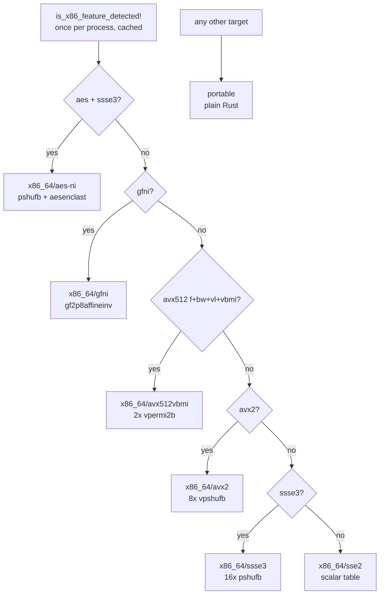
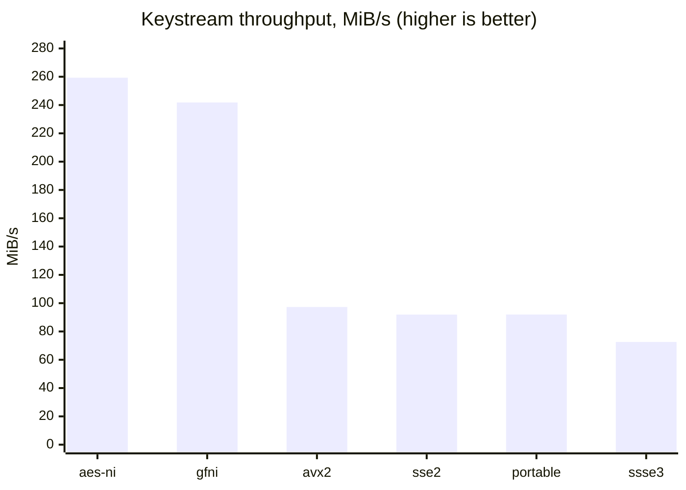

# pich256 🔩

A symmetric-key **stream cipher in pure Rust** — zero dependencies, self-contained
crypto primitives, and a hand-rolled big-integer layer. Derive a key from a
passphrase, and encrypt or decrypt a byte stream by XORing it with a
keystream produced by an evolving 128-bit state.

> ⚠️ **Educational / experimental.** pich256 is a learning project, not a
> vetted cryptographic library. It has had no third-party review, provides no
> authentication (MAC), and no per-message nonce. **Do not use it to protect
> real secrets.** For production use reach for an audited AEAD such as
> `chacha20poly1305` or `aes-gcm`.

## Features

- **Pure Rust, zero dependencies** — SHA-256, HMAC-SHA-256, the key schedule,
  and the 128/192/256-bit integer arithmetic are all implemented in-tree.
- **Passphrase-based keying** — any string is stretched to a 256-bit key via an
  HKDF-style (HMAC-SHA-256 extract-then-expand) derivation.
- **SPN-flavored round function** — rotate → Rijndael (AES) S-box substitution →
  round-key XOR, over a 16-entry Fibonacci subkey ring.
- **Data-dependent keystream tap** — each output byte is read from a position
  chosen by the state itself.
- **Symmetric API** — `encrypt` and `decrypt` are the same XOR operation.
- **Runtime-dispatched hardware acceleration** — AES-NI/GFNI for the S-box,
  SHA-NI for the KDF, SIMD intrinsics and inline assembly elsewhere, selected by
  CPU detection at runtime, with a portable software fallback everywhere else.
  ~2.8× on the cipher, ~6× on SHA-256. See
  [Hardware acceleration](#hardware-acceleration).

## How it works (at a glance)

1. **Key derivation** — `PRK = HMAC-SHA256(0³², passphrase)`, then
   `OKM = HMAC-SHA256(PRK, 0x01)` gives a 256-bit key.
2. **Split** — the high 128 bits seed the initial state `W₀`; the low 128 bits
   seed the 16-key Fibonacci subkey schedule.
3. **Warm-up** — the state is advanced 62 rounds so the output is decorrelated
   from the raw key material.
4. **Keystream** — each byte costs 2 rounds; the byte is then read at index
   `w[0] & 0x0F`.
5. **Cipher** — `ciphertext = plaintext ⊕ keystream`.

For the full specification, math, and diagrams, see
[PICH256_DESIGN_DOCUMENT.md](PICH256_DESIGN_DOCUMENT.md).

## Hardware acceleration

All performance-sensitive primitives are routed through `src/arch`, which picks
an implementation **at runtime** by probing the host with
`is_x86_feature_detected!` once per process. One binary therefore runs correctly
everywhere: an AVX-512 machine takes the widest path, an SSE2-only machine takes
the narrowest, and nothing needs `-C target-cpu=native`. Every backend produces
**bit-for-bit identical** output, which the test suite checks by running each
supported backend against the portable reference.



| Backend | Requires | S-box strategy |
| :--- | :--- | :--- |
| `x86_64/aes-ni` | `aes ssse3` | `pshufb` + `aesenclast`, round-key XOR free |
| `x86_64/gfni` | `gfni` | one `gf2p8affineinv` |
| `x86_64/avx512vbmi` | `avx512f avx512bw avx512vl avx512vbmi` | 2× `vpermi2b` over a 256-byte table |
| `x86_64/avx2` | `avx2` | 8× `vpshufb`, two table rows per register |
| `x86_64/ssse3` | `ssse3` | 16× `pshufb`, one table row per register |
| `x86_64/sse2` | x86_64 baseline | scalar table lookup, vector XOR |
| `portable` | anything | plain Rust |

Alongside the S-box:

- **SHA-NI** (`sha256rnds2` / `sha256msg1` / `sha256msg2`) for the SHA-256
  compression behind the KDF — ~6× over the scalar loop.
- **Inline assembly** for the 128-bit primitives: `shld`/`shrd` double-precision
  shifts for the rotates, and `mul`/`imul` for the truncating 128×128 multiply.
- **SSE2/AVX2** for the state rotate and the bulk keystream XOR.

### Using the AES hardware

Pich256's confusion layer *is* the Rijndael S-box, so the substitution it needs
has been in x86_64 silicon since 2010. Two unrelated instruction sets provide it.

**AES-NI.** `aesenclast(x, k)` is a whole final AES round,
`SubBytes(ShiftRows(x)) ⊕ k`. `SubBytes` is bytewise and `ShiftRows` is a byte
permutation, so they commute and the `ShiftRows` can be cancelled by permuting
the input first:

```
aesenclast(InvShiftRows(x), k) = SubBytes(x) ⊕ k
```

`InvShiftRows` is one `pshufb`, so the S-box costs two instructions — and the
`⊕ k` arrives free, meaning `aesenclast` also absorbs the round's key-mixing
step. A full Pich256 round is the rotate, one `pshufb`, one `aesenclast`.

**GFNI.** `vgf2p8affineinvqb(x, A, b)` inverts each byte in GF(2⁸) under the AES
polynomial and applies the affine map `A·inv(x) + b` — the textbook definition of
the Rijndael S-box. With the Rijndael matrix and `b = 0x63` the substitution is a
*single* instruction, though the key XOR then costs a separate `pxor`.

AES-NI is preferred by the detector: folding in the key XOR makes it consistently
faster here (3.9 vs 4.1 ns/byte end to end). Since every CPU with GFNI also has
AES-NI, GFNI is in practice a documented alternative reachable via
`arch::force_backend`.

Both identities and both magic constants are checked against the 256-entry table
in **every one of the 16 lane positions** — a wrong `InvShiftRows` mask still
yields a permutation of the right bytes, so uniform test input would not catch it.

The shuffle-based backends (`avx512vbmi` / `avx2` / `ssse3`) emulate the same
table out of 16-entry byte shuffles and remain for CPUs without AES hardware, or
VMs that mask the feature bits off.

### Measured

```bash
cargo bench                          # Criterion, every backend
cargo run --release --example arch_bench   # quick human-readable summary
```

Criterion, 50 samples per point, on a CPU with AES-NI, GFNI, AVX2 and SHA-NI.
**Keystream generation** — the cipher's real cost centre:



| Backend | `encrypt` (64 KiB) | `keystream` | `sub_bytes` (4 KiB) |
| :--- | ---: | ---: | ---: |
| `aes-ni` | **259.6 MiB/s** | **259.3 MiB/s** | 78.8 GiB/s |
| `gfni` | 240.6 MiB/s | 241.8 MiB/s | **98.6 GiB/s** |
| `avx2` | 98.9 MiB/s | 97.3 MiB/s | 4.84 GiB/s |
| `sse2` | 91.5 MiB/s | 91.9 MiB/s | 6.13 GiB/s |
| `portable` | 91.3 MiB/s | 92.0 MiB/s | 6.13 GiB/s |
| `ssse3` | 72.6 MiB/s | 72.6 MiB/s | 3.53 GiB/s |

| SHA-256 compression | Throughput | |
| :--- | ---: | ---: |
| SHA-NI | **2.234 GiB/s** | 6.2× |
| portable | 0.360 GiB/s | 1.0× |

**AES hardware is worth ~2.8× end to end**, and 13–16× on bulk substitution.
GFNI overtakes AES-NI on bulk `sub_bytes` — with no round key to fold in, one
`gf2p8affineinv` beats `pshufb` + `aesenclast` — but loses on the round, which is
what the cipher actually runs, so the detector prefers AES-NI.

Without AES hardware the spread is small and not uniformly favourable: `avx2`
beats the scalar table by ~7% and `ssse3` *loses* to it by 21%, because a
256-entry byte substitution is close to the worst case for SIMD (an L1 lookup is
one micro-op; `pshufb` covers 16 entries). Those backends earn their place on
constant-time execution, not speed.

Two honest negatives: the vectorised bulk XOR is worth 2.8% (memory-bound at
64 KiB, and LLVM already auto-vectorises the portable loop), and the
inline-assembly `rotr128`/`mul128` are within noise of plain Rust — LLVM already
emits the same `shrd`/`mul` sequences, which is why `arch::x86_64::int`
documents itself as pinning codegen rather than beating the compiler.

### Features

Both are on by default and can be turned off independently:

```bash
cargo build --no-default-features                 # everything portable
cargo build --no-default-features --features asm  # inline asm, no SIMD
```

- `simd` — the architecture-specific vector backends.
- `asm` — the inline-assembly 128-bit integer primitives.

## API

| Method | Signature | Description |
| :--- | :--- | :--- |
| `Pich256::new` | `fn new(base_key: &str) -> Pich256` | Derive the key, build the subkey ring, and run 62 warm-up rounds. |
| `Pich256::encrypt` | `fn encrypt(&mut self, msg: &[u8]) -> Vec<u8>` | XOR each plaintext byte with the next keystream byte. |
| `Pich256::decrypt` | `fn decrypt(&mut self, ciphertext: &[u8]) -> Vec<u8>` | Identical operation; recovers plaintext under the same key. |
| `Pich256::backend_name` | `fn backend_name() -> &'static str` | Which code path this process selected, e.g. `"x86_64/avx2"`. |

## Examples

The repo ships runnable examples in [`examples/`](examples):

```bash
cargo run --example basic_usage
```

```bash
cargo run --example cli_encrypt -- "my passphrase" "attack at dawn"
```

```bash
cargo run --example key_sensitivity
```

```bash
cargo run --release --example arch_bench
```

`key_sensitivity` demonstrates the avalanche effect: two keys differing by a
single character produce ciphertexts that differ in nearly every bit.

## Testing

The crate has an extensive in-tree test suite covering the SHA-256/HMAC
primitives (FIPS 180-4 / RFC 4231 vectors), the big-integer arithmetic, the
S-box properties, the key schedule, and encrypt/decrypt round trips:

```bash
cargo test
```

The `arch` module additionally re-runs its equivalence tests once per backend the
host CPU can execute, so an AVX2 machine exercises the AVX2, SSSE3, SSE2 and
portable paths in a single `cargo test` run. Check the feature matrix too:

```bash
cargo test --no-default-features                        # portable only
cargo test --no-default-features --features simd
cargo test --no-default-features --features asm
```

## Benchmarks

[Criterion](https://github.com/bheisler/criterion.rs) benchmarks live in
[`benches/`](benches), parameterised over every backend the host CPU supports:

```bash
cargo bench                          # everything
cargo bench -- encrypt               # one group
cargo bench -- --save-baseline main  # record a baseline
cargo bench -- --baseline main       # compare a later run against it
```

Groups: `key_setup`, `encrypt`, `keystream`, `sub_bytes`, `round128`, `xor_into`,
`sha256_compress`, `int128`. The suite asserts every backend still agrees with
the portable reference *before* timing anything, so a correctness regression
cannot quietly present itself as a speedup.

Criterion is a `dev-dependency` with default features off, so it never reaches
anything that depends on this crate — the library itself stays dependency-free.
Enable its default features for HTML reports and plots.

## Project layout

```
benches/
└── pich256.rs       Criterion suite, parameterised over every backend

src/
├── lib.rs           crate root / module wiring
├── pich256.rs       Pich256 + internal State (round function, keystream)
├── kdf.rs           HKDF-style 256-bit key derivation
├── key_gen.rs       Fibonacci subkey schedule (generator g)
├── round_key.rs     Roundkey struct
├── rc.rs            round constants + expansion
├── sbox.rs          Rijndael S-box and the xbox/sboxes/cbox pipeline
├── sha256.rs        SHA-256 + HMAC-SHA-256
├── bigint/          I128 / I192 / I256 arithmetic types
└── arch/            hardware dispatch
    ├── mod.rs       runtime CPU detection + dispatched primitives
    ├── fallback.rs  portable reference implementation (all targets)
    └── x86_64/
        ├── aes.rs   AES-NI / GFNI S-box, round and keystream
        ├── sbox.rs  SSSE3 / AVX2 / AVX-512 S-box (no AES hardware needed)
        ├── int.rs   inline asm: shld/shrd rotates, mul/imul multiply
        └── sha.rs   SHA-NI block compression
```

## Roadmap / TODO

- [x] **Hardware acceleration with software fallback** — runtime CPU detection
  dispatching to AES-NI/GFNI, SHA-NI, SIMD and inline-assembly implementations on
  x86_64, with a portable pure-Rust path everywhere else. See
  [Hardware acceleration](#hardware-acceleration).
- [ ] **Backends for other architectures** — aarch64 NEON (`tbl`/`tbx` are a
  natural fit for the S-box) and wasm32 SIMD128. The dispatch layer and its
  differential tests are already in place; only the backends are missing.
- [ ] **Validate the AVX-512 VBMI path on real hardware** — it is written and
  compiles, but no AVX-512 machine has run it yet, so it remains untested.
- [ ] **Cryptanalysis & security testing** — statistical randomness suites
  (Dieharder / NIST STS / PractRand) on the keystream, avalanche and bit-bias
  measurements, and analysis of linear/differential resistance.
- [ ] **Improve the S-box and internal structure**
- [x] **Benchmarks** — Criterion benchmarks for throughput, key setup and every
  primitive, parameterised across the portable vs. accelerated paths. See
  [Benchmarks](#benchmarks).
- [ ] **Publish to [crates.io](https://crates.io)** — add crate metadata
  (description, keywords, categories, repository, docs), documentation, and cut
  a release.

## License

Licensed under the [MIT License](LICENSE).
